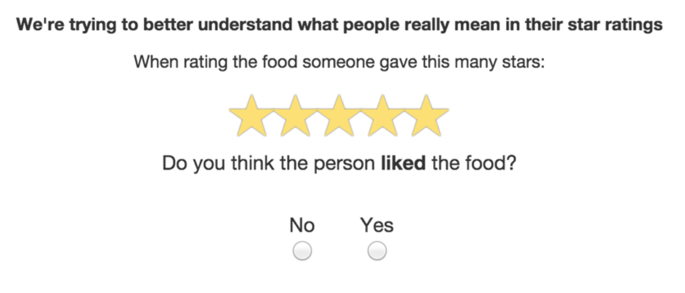
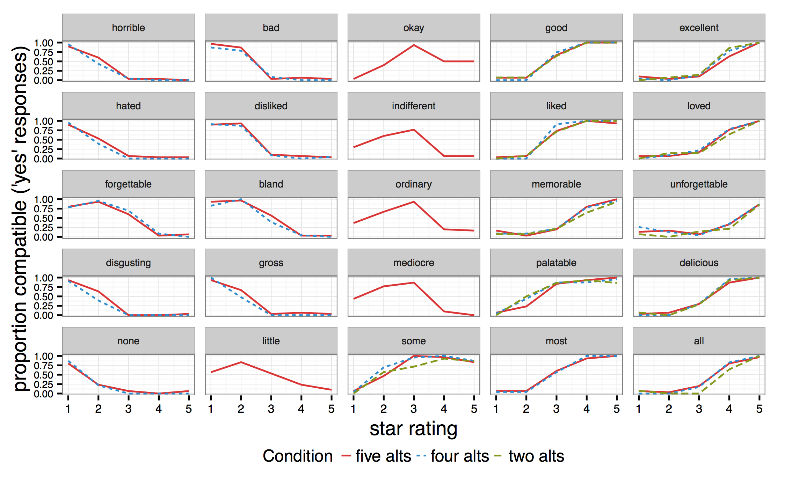
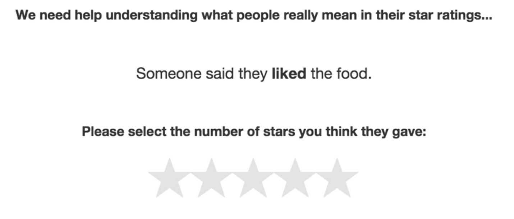
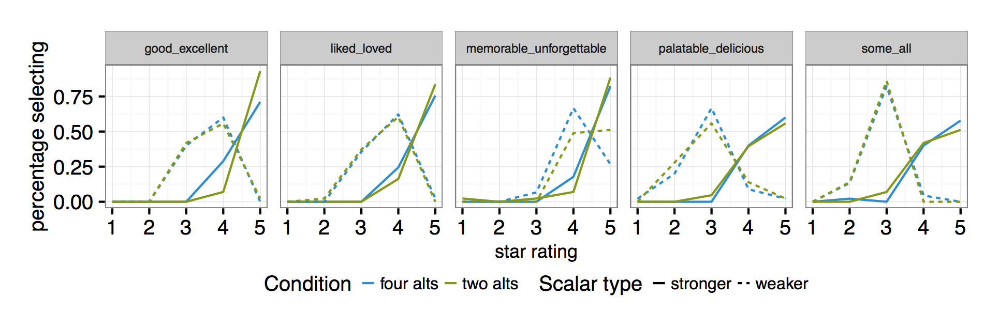
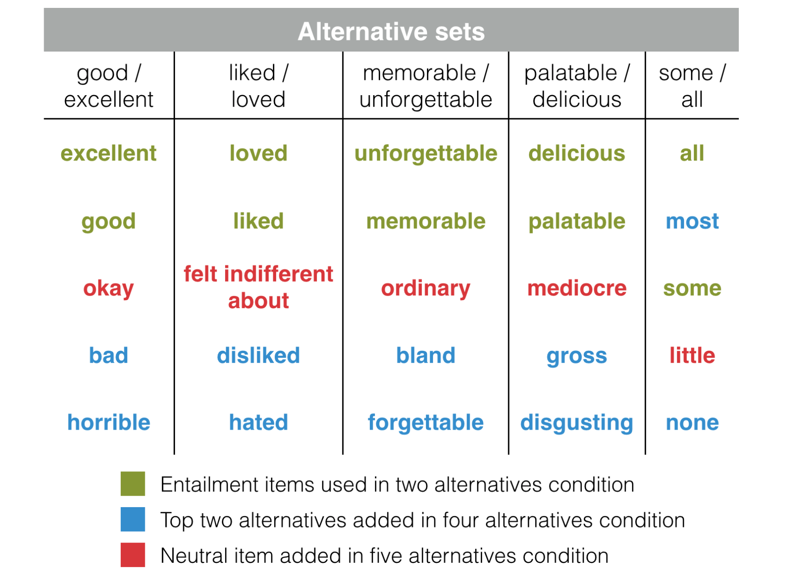
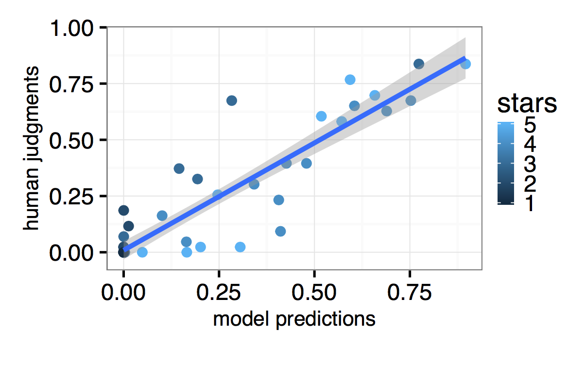
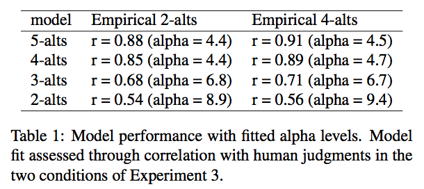

```{r setup}
# this loads all the rsa functions, rewritten for ease of reading 
source("setup.r")
```


## 1. Recap of paper 

#### Experiment 2: Literal Listener Task 

> Participants were presented with a target scalar item and a star rating (1–5 stars) and asked to judge the compat- ibility of the scalar item and star rating. Compatibility was assessed through a binary “yes/no” response to a question of the form, “Do you think that the person thought the food was ____ ?” where a target scalar was presented in the blank. Each participant saw all scalar item and star rating combinations for their particular condition, in a random order. <br><br> The two alternatives condition only included entailment pairs taken from van Tiel et al. (2014) for a total of 50 trials for each participant. The four alternatives condition included entailment pairs plus the top two alternatives generated for each scalar family by participants in Experiment 1 (100 trials per participant). The five alternatives condition included the four previous items plus one more neutral item chosen from alternatives generated in Experiment 1 (125 trials per participant). [SEE FIGURE 3, LEFT]

```{r out.width="75%"}

```


> Literal listener judgments from Experiment 2. Proportion of participants indicating compatibility (answering “yes”) is shown on the vertical axis, with the horizontal axis showing number of stars on which the utterance was judged. Rows are grouped by scale and items within rows are ordered by valence. Colors indicate the specific condition with conditions including different numbers of items.

```{r}

```


#### Experiment 3: Pragmatic Listener Task 

##### Setup 

> Participants were presented with a one-sentence prompt such as “Someone said they thought the food was ____ .” with a target scalar item in the blank. Partic- ipants were then asked to generate a star rating representing the rating they thought the reviewer likely gave. Each participant was presented with all scalar items in a random order. Participants in the two alternatives condition gave a total of 10 pragmatic judgments. Participants in the four alternatives condition gave a total of 20 pragmatic judgments. [SEE FIGURE 3, RIGHT]

```{r out.width="75%"}

```

##### Results  

> Pragmatic listener judgments from Experiment 3. Vertical axis shows proportion of participants generating a star rating. Horizontal axis shows number of stars on which the utterance was judged. Line type denotes condition and colors indicate the particular scalar items. Each panel shows one entailment scalar pair. 

```{r}

```


#### Model Simulations 

##### Setup 

> Using literal listener data from Experiment 2, we conducted a set of simulations with the RSA model. Each simulation kept the model constant, fitting the choice parameter α as a free parameter, but used a set of alternatives to specify the scale over which predictions were computed. We considered four different alternative sets, with empirical measurements corresponding to those shown in Figure 1: 1) the two alternatives in the classic entailment scales, 2) those two alternatives with the addition of a generic negative alternative, 3) the expanded set of four alternatives, and 4) the expanded set of five alter- natives. Literal semantics for the generic negative alternative served as a baseline “none” semantics in which the scalar item was only compatible with 1 star. [SEE FIGURE 1]


```{r out.width="75%"}

```


##### Results 

> Model fit with human judgments was significantly improved by the inclusion of alternatives beyond the entailment items (Table 1). The two alternatives model contained only entailment items, which, under classic accounts, should be sufficient to generate implicature, but fit to data was quite poor with these items. The addition of a generic negative element produced some gains, but much higher performance was found when we included four and five alternatives, with the alternatives derived empirically for the specific scale we used.  [SEE FIGURE 6]

```{r}

```

```{r}

```


## 2. Overview of model implementation code 

Below is a listing of the contents of the `rrrsa::` package. 

#### Five datasets 
```{r}
# FIVE DATASETS
rsa_data <- list(
  # from frank et al submitted:
  frank = rrrsa::d_pragmods,
  # from pelfrank16: 
  pf2   = rrrsa::peloquinFrank_2Alts,
  pf3   = rrrsa::peloquinFrank_3Alts,
  pf4   = rrrsa::peloquinFrank_4Alts,
  pf5   = rrrsa::peloquinFrank_5Alts
)
```


#### Three helper functions 
```{r}
# THREE HELPER FUNCTIONS
rsa_helper <- list(
  # converts vec2 to whatever type vec1 is
  convertVecType = rrrsa::rsa.convertVecType, 
  # this is just `function(x) x/sum(x)` for positive `x`
  normVec        = rrrsa::rsa.normVec, 
  # just changes desired column names 
  renameCol      = rrrsa::rsa.renameCol
)
```


#### Six analysis functions 
```{r}
# SIX ANALYSIS FUNCTIONS
rsa_model <- list(
  # computes informativity given params `m_u`, `alpha`, `cost`
  informativity  = rrrsa::rsa.informativity,
  # computes utility given params `items`, `costs`, `alpha`
  utility        = rrrsa::rsa.utility,
  # wrapper that runs `depth`-many iterations of `rsa.fullRecursion()` 
  reason         = rrrsa::rsa.reason,
  # wrapper around `rsa.reason` that accepts input as a data frame 
  runDf          = rrrsa::rsa.runDf,
  # explores correlation between data and model preds for varying `alpha` 
  tuneDepthAlpha = rrrsa::rsa.tuneDepthAlpha,
  # main function implementing RSA model 
  fullRecursion  = rrrsa::rsa.fullRecursion
)
```


## 3. Reproduce the paper results 

### 3.1 A toy example (adapted from package vignette)

#### Get the literal semantics for *none*, *some*, *all* 
```{r}
semantics_matrix <- matrix(
  nrow=5, ncol=3, dimnames=list(paste0("row", 1:5), c("none","some","all")), 
  data=c(1.0, .00, .00, 
         .00, .00, .00, 
         .25, .25, .25, 
         .25, .00, .00, 
         .00, .00,  1)
)
# semantics_df <- rsa_matrix_to_df(semantics_matrix, 
#                                  response_colname="semantics")
```

#### Fix model parameters 
```{r}
### NEED TO MAKE SURE THESE MATCH THE SHAPE OF THE SEMANTICS MATRIX 
# m/dat_pre ~~> matrix of semantics (rows=meaning (m rows), cols=words (n cols))
# costs     ~~> ncol(m) vector of costs (default is 0 valued vector)
# priors    ~~> nrow(m) vector of priors (default is uniform)
# alpha     ~~> decision hyper-param

costs <- c(none=0, some=0, all=0)
priors <- rnorm(nrow(semantics_matrix), mean=.5, sd=.1)
alpha <- 1

print(costs)
print(priors)
```

#### Calculate posterior 
```{r}
# same as: 
# rsa.fullRecursion(m=m, costs=rep(0, ncol(m)), priors=rep(1, nrow(m)), alpha=2)
pragmatics_matrix <- fullRecursion(
  m=semantics_matrix, 
  costs=costs, priors=priors, alpha=alpha
)
# pragmatics_df <- rsa_matrix_to_df(semantics_matrix,
#                                   response_colname="pragmatics")

knitr::kable(semantics_matrix, row.names=TRUE)
knitr::kable(pragmatics_matrix, row.names=TRUE)
```


#### Visualize "semantics" versus "pragmatics" 

```{r}
make_rsa_plot(semantics_matrix, pragmatics_matrix)
```


### 3.2 Inspect actual experimental data 

#### get acquainted with the datasets, combine them 

```{r}
# each dataset from the paper has these columns: 
nams <- c("exp", "scale", "stars", "speaker.p", "words", "e11", "e6")

# column descriptions from documentation: 
# 
#   1) quantityVarName :: "stars"
#   2) semanticsVarName :: "speaker.p"
#   3) itemVarName :: "words"
#   4) groupVarName :: "scale"
#   other) experiment number :: "exp"
#   other) Pragmatic judgments study 1 (e6), study 2 (e11)

# dimensions and colnames of each dataset 
sapply(rsa_data, dim)
sapply(rsa_data, function(df){ identical(names(df), nams) })

# just want to consider the data from the peloquin & frank paper 
pf_data <- rsa_data[names(rsa_data)[names(rsa_data) != "frank"]]

# combine all of the PF16 datasets into a single df 
pf_data <- lapply(seq_along(pf_data), function(idx){
  pf_data[[names(pf_data)[idx]]] %>% 
    mutate(dataset = names(pf_data)[idx]) %>% 
    mutate_if(is.factor, as.character) %>% 
    rename(study1=e6, study2=e11)
}) %>% 
  (function(df_list) do.call(rbind, df_list))

# and look at its structure
str(pf_data)

# each row is a unique combo of scale, stars, words, dataset 
pf_data %>% group_by(scale, stars, words, dataset) %>% count() %$% table(n)
```


#### Reproduce Figure 4 from PF16 

NOTE: these are by-item averages for Expt2 (the number of trials for 2, 4, and 5 alternatives matches description on page 321)

```{r}
d <- pf_data %>% 
  filter(dataset %in% c("pf2", "pf4", "pf5")) 

knitr::kable(d %>% group_by(dataset) %>% summarize(rows = n()))
```

Here are the words used for each scale in Expt2: 
```{r}
d %>% group_by(dataset, scale) %>% summarize(
  rows = n(), 
  words = paste(sort(unique(words)), collapse=" | ")
) %>% knitr::kable()
```


Unclear which column is plotted in Figure 4, so try all three and inspect results of each. 

```{r}
d %>% 
  ggplot(aes(x=stars, y=speaker.p, color=scale, linetype=dataset)) + 
  geom_line() + 
  facet_wrap(~words) + 
  labs(title="fig4(?) -- plotting column d$speaker.p")
```

```{r}
d %>% 
  ggplot(aes(x=stars, y=study1, color=scale, linetype=dataset)) + 
  geom_line() + 
  facet_wrap(~words) + 
  labs(title="fig4(?) -- plotting column d$study1")
```


```{r}
d %>% 
  ggplot(aes(x=stars, y=study2, color=scale, linetype=dataset)) + 
  geom_line() + 
  facet_wrap(~words) + 
  labs(title="fig4(?) -- plotting column d$study2")
```


#### Reproduce Figure 5 from PF16 

```{r}
lo_words <- c("good","liked","memorable","palatable","some")
hi_words <- c("excellent","loved","unforgettable","delicious","all")

d <- pf_data %>% 
  filter(dataset %in% c("pf2", "pf4")) %>% 
  filter(words %in% c(lo_words, hi_words))
  
table(d$dataset) # color is 4alts, 2alts
table(d$scale)   # facet by scale 
table(d$words)


d$scale_pos <- case_when(
  d$words %in% lo_words ~ "lo", 
  d$words %in% hi_words ~ "hi"
)

# two rows per combo, from `$exp` column (e8 and e10) 
d_summary <- d %>% group_by(scale, scale_pos, stars) %>% summarize(
  rows = n(), 
  mean_speaker_p = mean(speaker.p),
  mean_study1 = mean(study1), 
  mean_study2 = mean(study2)
) %>% ungroup()

d_summary %>% 
  # also include  "mean_speaker_p" to show model predictions(????)
  melt(measure.vars=c("mean_study1", "mean_study2")) %>%  
  ggplot(aes(x=stars, y=value, color=variable)) + 
  # geom_point() + 
  geom_line(aes(linetype=scale_pos)) + 
  facet_wrap(~scale, nrow=1) + 
  labs(title="reproduction of figure 5 from PF16")


d_summary %>% ggplot(aes(x=stars, y=mean_study1, color=scale_pos)) + 
  geom_point() + 
  geom_line() + 
  facet_wrap(~scale)
```


### 3.3 Specific example: Expt2, three alts, <*none, some, all*>

```{r}
# carve out the <none, some, all> scale from three-alts(??)
# pf_data %>% filter(scale=="some_all") %>% View()
pf3_NSA <- pf_data %>% 
  filter(dataset=="pf3") %>% 
  filter(scale=="some_all") %>% 
  select(-exp, -scale, -dataset) %>% 
  select(stars, words, study1, study2, speaker.p) %>% 
  arrange(stars, words) 

# all response fields are 0 for none, across the whole scale...
# pf3_NSA %>% filter(words=="none") %>% View() # *** 

pf3_NSA_study1 <- pf3_NSA %>% 
  select(stars, words, value=study1) %>% 
  tidyr::spread(words, value) %>% 
  set_rownames(.$stars) %>%  # `stars` now encoded as rownames
  select(none, some, all) %>% 
  as.matrix()


# this is the semantic representation (prob dist) of each scalar item 
input_matrix <- pf3_NSA_study1

# need to make sure length matches ncol
costs <- c(none=0, some=0, all=0)  

# need to make sure length matches nrow 
priors <- rnorm(nrow(input_matrix), mean=.5, sd=.1) 

# parameter that fixes "how much the cost matters" 
alpha <- 1
```

#### Calculate posterior 

```{r}
# calculate the posterior distributions for each scalar item 
output_matrix <- fullRecursion(
  input_matrix, costs=costs, priors=priors, alpha=alpha
)

knitr::kable(input_matrix, row.names=TRUE)
knitr::kable(output_matrix, row.names=TRUE)

make_rsa_plot(input_matrix, output_matrix)
```


### 3.3 Specific example: [WHATEVER SEEMS MOST INTERESING!]


```{r}
### STEPS FOR DOING ONE FULL ITERATION OF RSA MODEL 
# 
# 1. carve out a subset of the main data `pf_data`
# ...
# 
# 2. get it into matrix format -- `input_matrix`
# ...
# 
# 3. specify costs, priors, and alpha 
# ...
# 
# 4. call `fullRecursion()` on the matrix, with params -- `output_matrix`
# ... 
# 
# 5. visualize result 
# make_rsa_plot(input_matrix, output_matrix) 


### STEPS FOR DOING MORE THAN ONE ITERATION 
# prep the data to an `input_matrix`, 
# specify parameters, 
# and then call `reason()` on it 
```


## 4. Play around with parameters + see how that changes results!  

```{r}
# HINT: TRY SETTING THE COSTS VERY HIGH AND ALPHA VERY LOW 
semantics_matrix <- matrix(
  nrow=5, ncol=3, dimnames=list(paste0("row", 1:5), c("none","some","all")), 
  data=c(1.0, .00, .00, 
         .00, .00, .00, 
         .25, .25, .25, 
         .25, .00, .00, 
         .00, .00,  1)
)

costs <- rep(1, ncol(semantics_matrix))
priors <- rep(.5, nrow(semantics_matrix))
alpha <- 1
depth <- 1
recycle_priors <- TRUE

# same as `rsa.reason()` but source code is cleaner 
pragmatics_matrix <- reason(
  semantics_matrix, 
  costs=costs, priors=priors, alpha=alpha, depth=depth, 
  recycle_priors=recycle_priors
)

make_rsa_plot(semantics_matrix, pragmatics_matrix)


# same as `rsa.fullRecursion()` but source code is cleaner 
# also same as `reason` but with depth=1
fullRecursion(
  input_matrix, 
  costs=costs, priors=priors, alpha=alpha
)
```


## Concepts used in RSA models 

#### primitive principles 

- speech-acts are rational behaviors -- actions in **signaling games** 
- utterances are selected by their **expected utility** 
- the utility of an utterance is a function of its **informativity** and its **cost** 

#### model of a conversational exchange 

- a **speaker** $S_n$ wants to communicate some proposition 
- $S_n$ selects utterance $u$ from a set of alternative utterances 
- an actual ("pragmatic") **listener** reasons about the meaning based upon the utility of the actual utterance given the state of the world 
- ... 


## The mathematics underlying RSA models 

The following equations are from Goodman & Frank's (2012) model specification. 


#### Equation 1 (GF2012)


$$P(r_s|w, C) = \frac{P(w|r_s, C)\times P(r_s)}{\sum\limits_{r'\in C} P(w|r', C) \times P(r')}$$

where 

- $r_s$ is an intended referent (element of $C$), 
- $C$ is a context (set of objects $r, r', ...\in C$), and 
- $w$ is the word uttered by the speaker. 
- The **prior** is $P(r_s)$, 
- the **likelihood** is $P(w|r_s, C)$, and 
- the **normalizing constant** is $\sum\limits_{r'\in C} P(w|r', C) \times P(r')$

<br>

#### Equation 2 (GF2012)

$$P(w|r_s, C) = \frac{|w|^{-1}}{\sum\limits_{w'\in W} |w'|^{-1}}$$

where 
- $|w|$ is the number of objects in $C$ to which word $w$ could(?) apply, 
- and $W$ is the set of words that apply to the intended referent $r_s$.  

<br>

#### Equation S1 (GF12 supplement)


$$P(w|r_s, C) \propto e^{\alpha\times U(w; r_s, C)}$$

where 

- the **context** $C = \{o_1, ..., o_n\}$ is a set of objects 
- the **vocabulary** is a set of words $V = \{w_1, ..., w_m\}$ 
- each word $w\in V$ has a meaning $[\![ w ]\!] : C \rightarrow \{0, 1\}$ 
- words are chosen in proportion to their expected utility 

<br>

#### Equation S2 -- utility (GF12 supplement)


$$U(w; r_s, C) = I(w; r_s, C) - D(w)$$

where 

- $I(w; r_s, C)$ is the informativeness of utterance $w$ w.r.t. intended referent $r_s \in C$, and 
- $D(w)$ is $w$'s cost (in $C$?). (for single words, $D : V \rightarrow \mathbb{R}^+$ is constant)

<br>

#### Surprisal (GF12 supplement)

for a sample $x$ from a known distribution $p(x)$, the surprisal of $x$ is
$$I_p(x) = -log(p(x))$$

<br>

#### Utility and surprisal (GF12 supplement)

utility decreases with surprisal: 

$$I(w; r_s, C) = -I_{\widetilde{w}_C}(r_s)$$

where $\widetilde{w}_C$ is the distribution over objects that would come froma  aliteral interpretation of $w$ in context $C$. 


<br>

#### Equation S3 -- literal listener model derivation (GF12, supplementary materials)

"if listeners interpret the utterance $w$ literally, assigning zero probability to objects for which the word is false, they assign equal probability to each object conssitent with $w$. This distribution over objects can be written:"

$$\widetilde{w}_C(o) = 
    \begin{cases}
    \frac{1}{|w|} & \text{if } w(o) = true\\\\
    0             & \text{otherwise }
    \end{cases}$$


<br>

#### Equation S4 -- listener likelihood (GF12, supplement)

equation S4 follows from S1-S3, which is equivalent to equation 2 (aka "the size principle")


$$P(w|r_s, C) = \frac
                    {e^{-(-\log(|w|^{-1}))}}
                    {\sum\limits_{w'\in V \text{s.t. } w'(r_s) = true} e^{-(-\log(|w'|^{-1}))}}$$


"Thus in our experiments, the speaker's abstract goal of being informative reduces to a simple formulation: whoose a word that applies to the referent and picks out a relatively smaller section of the context. Listeners may then use this model of a speaker as their likelihood function, to be combined with prior information about contextual salience as in Equation 1 in the main text."

<!-- A `pragmatic listener` $P_{L_n}(m|u)$, reasons about intended meaning $m$ of an utterance $u$ by a `rational speaker` $P_{s_n}(u|m)$ who chooses an utterance according to the expected utility of an utterance $U(m;u)$. $\alpha$ is a decision noise parameter. -->

<!-- $$P_{L_n}(m|u) \propto P_{S_n}(u|m)P(m)$$ -->
<!-- $$P_{S_n} \propto e^{U(m;u)}$$ -->
<!-- $$U(m;u) = -\alpha(-\log(P_{L_{n-1}}(m|u)) - C(u))$$ -->

<!-- See Frank & Goodman (2012) and Goodman & Stuhmuller (2013) for the original descriptions of the RSA framework. Frank, et al. (Under Review) also provides a comprehensive presentation and evaluation of RSA. -->


```{r eval=FALSE, include=FALSE}
# THIS IS JUST TIM MISC NOTES TO SELF! 

### rrrsa::rsa.fullRecursion(m, costs, priors, alpha) ------
# `m` a matrix
# `costs` a vector of costs, w length == ncol(m) (defaults to zeros)
# `priors` vector of priors, w length == nrow(m) (defaults to ones)
# `alpha` scalar noise param, defaults to 1 
# returns a posterior distribution 
rrrsa::rsa.fullRecursion(m, costs, priors, alpha)

# pdist=runif; nvals=100; ncols=4; params=c(0,1)
fullrec <- function(pdist, nvals, ncols, params){
  set.seed(3369)
  m <- matrix(pdist(nvals, params[1], params[2]), ncol=ncols)
  if (min(m) < 0) message("converting negative vals to positive")
  m <- abs(m); m <- m/sum(m)
  m_post <- rrrsa::rsa.fullRecursion(m=m)
  par(mfrow=c(1,3)); print(hist(m)); print(hist(m_post)); print(plot(m, m_post))
  title(paste0("with nvals=",nvals," ncols=",ncols, 
               "\nparams=",paste(params, collapse=",")))
}
lapply(c(2,4,5,10,100), function(ncols){
  fullrec(pdist=runif, nvals=1e3, ncols=ncols, params=c(0,1))
})
lapply(c(2,4,5,10,100), function(ncols){
  fullrec(pdist=rnorm, nvals=1e3, ncols=ncols, params=c(0,1))
})

```


<style>
<!-- /* use this to get font import code: http://fonts.googleapis.com/css?family=FONT+NAME*/ -->
<!-- /* use **latin**, not latin-extended */ -->
@font-face {
  font-family: 'Source Sans Pro';
  font-style: normal;
  font-weight: 400;
  src: local('Source Sans Pro Regular'), local('SourceSansPro-Regular'), url(https://fonts.gstatic.com/s/sourcesanspro/v11/ODelI1aHBYDBqgeIAH2zlJbPFduIYtoLzwST68uhz_Y.woff2) format('woff2');
  unicode-range: U+0000-00FF, U+0131, U+0152-0153, U+02C6, U+02DA, U+02DC, U+2000-206F, U+2074, U+20AC, U+2212, U+2215;
}


@font-face {
  font-family: 'Roboto Mono';
  font-style: normal;
  font-weight: 400;
  src: local('Roboto Mono'), local('RobotoMono-Regular'), url(https://fonts.gstatic.com/s/robotomono/v5/hMqPNLsu_dywMa4C_DEpY4gp9Q8gbYrhqGlRav_IXfk.woff2) format('woff2');
  unicode-range: U+0000-00FF, U+0131, U+0152-0153, U+02C6, U+02DA, U+02DC, U+2000-206F, U+2074, U+20AC, U+2212, U+2215;
}


body {
  padding: 10px;
  font-size: 12pt;
  font-family: 'Source Sans Pro', sans-serif;
}

h4 {
  margin-top: 32px;
  font-weight: bold;
}

blockquote {
  font-size: 12pt;
  font-family: 'Source Sans Pro', sans-serif;
}

code {
  font-family: 'Roboto Mono', monospace;
  font-size: 13px;
}

pre {
  font-family: 'Roboto Mono', monospace;
  font-size: 13px;
}

.table {
  width: 75%;
  align: center;
}


h3.subtitle {
  font-size: 26px;
  /*color: #aca39a;*/
  font-style: normal !important;
  font-weight: lighter !important;
  border-bottom: none;
  padding-top: 4px !important;
}

h4.author { 
  font-size: 22px;
  color: #aca39a;
  font-weight: lighter !important;
  padding-top: 0px !important;
  margin-top: 2px !important;
  margin-bottom: 12px !important;
  padding-bottom: 12px !important;
}

h3 {
  margin-top: 42px;
}

h2 {
  margin-top: 48px;
  border-bottom: 2px solid; 
}


</style>

